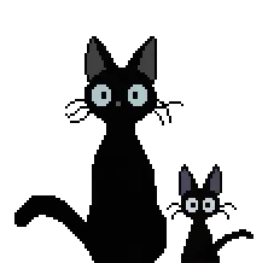
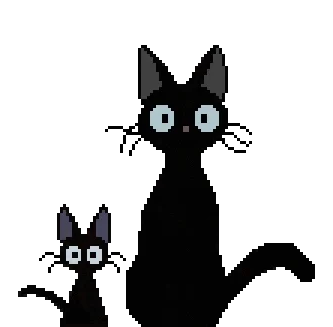

<h1 align="center">Anderson Oki</h1>

<h3 align="center">Software Engineer</h3>

<h5 align="center">Japan</h5>

 

  
  

<h3 align="left">🧑🏻‍💻  𝔸𝕓𝕠𝕦𝕥 𝕄𝕖</h3>

I started coding as a hobby in 2002 as a self-taught web developer. After 2 years of coding 7 days per week, 6 hours per day. In 2004 i decided to take a challenge to the next level, and took a job as freelancer web developer.  I have been managing and leading engineering teams for over a decade, but my passion is to deliver value by hands-on coding. What do i love about coding? Instant feedback on what i am building, see the result of what i am constructing as it goes.

<h3 align="left">🌟 𝕍𝕒𝕝𝕦𝕖𝕤</h3>

<h4 align="left">𝙿𝚎𝚛𝚏𝚎𝚌𝚝𝚒𝚘𝚗𝚒𝚜𝚖</h4>

When i'm building a product, i focus on excelence, to deliver the best, or plan what is the best. By creating a balance of the quality and speed to deliver the number one product.

<h4 align="left">𝙲𝚑𝚊𝚕𝚕𝚎𝚗𝚐𝚎</h4>

I enjoy challenging myself and try something new to seek improvement. Continuous growth is what keep me going and having fun coding.

<h4 align="left">𝚃𝚎𝚊𝚖𝚠𝚘𝚛𝚔</h4>

Build Fast, Build Alone. Build Longer, Build Together. This is what i believe, and working on project with more people, brainstorming, planning is what keeps me in the right direction.  I believe that for long lived products teamwork is essential to have a happy health product.

<h3 align="left">🧬 ℂ𝕙𝕒𝕣𝕒𝕔𝕥𝕖𝕣𝕚𝕤𝕥𝕚𝕔𝕤</h3>

Adventurer: As a Software Engineer, I consider myself an adventurer. Someone that loves to explore new technologies and push boundaries to deliver value.  My strong skill is the quick adaptation and seek for excellence mastering the tools that are available and create the ones that are not available.

<h3 align="center">𝕄𝕪 ℙ𝕚𝕔𝕜𝕤</h3>

  
  
  
  

<h3 align="center">ℙ𝕣𝕠𝕘𝕣𝕒𝕞𝕞𝕚𝕟𝕘 𝕃𝕒𝕟𝕘𝕦𝕒𝕘𝕖𝕤</h3>

  
  
  
  
  
  
  
  
  
  
  
  
  

<h3 align="center">𝔽𝕣𝕠𝕟𝕥𝕖𝕟𝕕 𝔽𝕣𝕒𝕞𝕖𝕨𝕠𝕣𝕜𝕤</h3>

  
  
  
  
  
  
  
  
  

<h3 align="center">𝔹𝕒𝕔𝕜𝕖𝕟𝕕 𝔽𝕣𝕒𝕞𝕖𝕨𝕠𝕣𝕜𝕤</h3>

  
  
  
  
  
  

<h3 align="center">ℂ𝕝𝕠𝕦𝕕 𝕊𝕖𝕣𝕧𝕚𝕔𝕖𝕤</h3>

  
  
  
  

<h3 align="center">𝔾𝕒𝕞𝕖 𝔼𝕟𝕘𝕚𝕟𝕖𝕤</h3>

  
  
  

<h1 align="center">ℍ𝕠𝕓𝕓𝕚𝕖𝕤</h1>

<h2 align="center">𝔸𝕟𝕚𝕞𝕖</h2>

Watching Anime and getting immersed in the fantasy world refreshes me and puts me ready for more.

 
 

<h2 align="center">𝔾𝕒𝕞𝕚𝕟𝕘</h2>

Playing video games gives me adrenaline and boost my moral, gives me creativity and pump my emotions.

 

